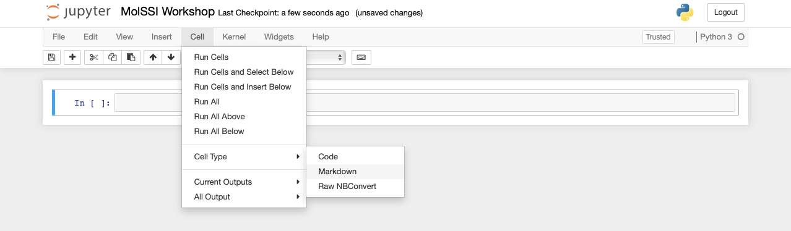

## Getting Started
Python is a computer programming language that has become ubiquitous in scientific programming.  Our initial lessons will run python *interactively* through a python interpreter. We will first use a Jupyter notebook.  The [setup] page should have provided information
on how to install and start a Jupyter notebook.  Everything included in a code block is something you could type into your python interpreter and evaluate.

### Setting up your Jupyter notebooks
In the [setup], you learned how to start a Jupyter notebook. Now, we will use the notebook to execute Python code. Jupyter notebooks are divided into cells. You run a Jupyter notebook one cell at a time. To execute a cell, click inside the cell and press `shift+enter`.

In the upper left corner, click where it says "Untitled" and change the name to "MolSSI Workshop". We have now changed the name of the Jupyter Notebook.

Jupyter notebooks allow us to also use something called **markdown** in some cells. We can use markdown to write descriptions about our notebooks for others to read. It's a good practice to have your first cell be markdown to explain the purpose of the notebook. Let's do that in our first cell. Click inside the first cell, then on the top of the screen select `Cell->Cell Type->Markdown` (shown below).



Now, return to the cell and type the following:

~~~
# MolSSI Workshop
## Introduction

This lesson covers Python basics like variable creation and assignment and using the Jupyter notebook
~~~
{: .language-markdown}

In Markdown, we create headers using a single `#` sign. Using two (`##`) creates a subheader. After typing this into a cell, press `shift+enter` to evaluate. Now your notebook should look like the following.


Now that our notebook is set-up, we're ready to start learning some Python!

## Assigning variables and data types

Any python interpreter can work just like a calculator.  This is not very useful. Type the following into the next cell of your Jupyter notebook.

```
3+7
```
{: .language-python}

```
10
```
{: .output}

Here, Python has performed a calculation for us. To save this value, or other values, we assign them to a variable for later use. The syntax for assigning variables is the following:
~~~
variable_name = variable_value
~~~
{: .language-python}

Let's see this in action with a calculation. Type the following into the next cell of your Jupyter notebook.
```
# Calculations using the Michaelis-Menten Equation
Km = 15.0                # Km = 15 micromolar
Vmax = 100.0             # Vmax = 100.0 nanomoles/sec
S = 8.0                  # Substrate concentration is 8.0 micromolar
Velocity = Vmax * S/(Km + S)    # Michaelis-Menten equation
```
{: .language-python}

Notice several things about this code.  You can use `#` to add comments to your code, both at the start of a line and in the middle of the line (then the rest of the line is a comment).  The computer does not do anything with these comments.  They have been used here to remind the user what units each of their values are in. Comments are also often used to explain what the code is doing or leave information for future people who might use the code.  

When choosing variable names, you should choose informative names so that someone reading your code can tell what they represent.  Naming a variable temp or temperature is much more informative than naming that variable t.

We can now access any of the variables from other cells. Let's print the value that we calculated. In the next cell,

~~~
print(Velocity)
~~~
{: .language-python}

```
34.78260869565217
```
{: .output}

In the previous code block, we introduced the `print()` function.  Often, we will use the print function just to make sure our code is working correctly.

Note that if you do not specify a new name for a variable, then it doesn't automatically change the value of the variable; this is called being *immutable*.  For example if we typed
```
print(Velocity)
Velocity*1000
print(Velocity)
```
{: .language-python}
```
34.78260869565217
34.78260869565217
```
{: .output}

Nothing happened to the value of `Velocity`.  If we wanted to change the value of `Velocity` we would have to re-save the variable using the same name to overwrite the existing value.
```
print(Velocity)
Velocity = Velocity * 60
print(Velocity)
```
{: .language-python}
```
34.78260869565217
2086.9565217391305
```
{: .output}

There are situations where it is reasonable to overwrite a variable with a new value, but you should always think carefully about this.  Usually it is a better practice to give the variable a new name and leave the existing variable as is.  
```
print(Velocity)
V_nmols_per_min = Velocity * 60
print(Velocity)
print(V_nmols_per_min)
```
{: .language-python}
```
34.78260869565217
34.78260869565217
2086.9565217391305
```
{: .output}

## Assigning multiple variables at once
Python can do what is called multiple assignment where you assign several variables their values on one line of code.  The following code block does the exact same thing as the previous code block.

```
#I can assign all these variables at once
Km, Vmax, S = 15.0, 100.0, 8.0
Velocity = Vmax * S/(Km + S)
print(Velocity)
```
{: .language-python}

```
34.78260869565217
```
{: .output}

## Data types
Each variable is some particular type of data.  The most common types of data are strings (`str`), integers (`int`), and floating point numbers (`float`).  You can identify the data type of any variable with the function `type(variable_name)`.
```
type(Velocity)
```
{: .language.python}
```
float
```
{: .output}
You can change the data type of a variable like this.  This is called casting.
```
Velocity_string = str(Velocity)
type(Velocity)
```
{: .language-python}
```
str
```

## Lists
Another common data structure in python is the list.  Lists can be used to group several values or variables together, and are declared using square brackets [ ]. **Python assigns special meanings to square brackets [], parentheses () and curly brackets {}, so you must be very careful with these characters.** List values are separated by commas. Python has several built in functions which can be used on lists. The built-in function `len` can be used to determine the length of a list. This code block also demonstrates how to print multiple variables.
```
# This is a list
S = [1.0, 2.0, 3.0, 4.0, 6.0, 8.0, 10.0, 15.0, 20.0, 30.0, 50.0, 75.0, 100.0] #micromolar
# I can determine its length
S_length = len(S)
# Print the length of the list
print('This list contains', S_length, 'substrate concentrations')
```
{: .language-python}

```
The length of this list is 13.
```
{: .output}

If you want to operate on a particular element of the list, you use the list name and then put in brackets which element of the list you want.  **In python counting starts at zero.  So the first element of the list is `list[0]`**

```
# Print the first element of the list
print(S[0])
```
{: .language-python}

```
1.0
```
{: .output}

You can use an element of a list as a variable in a calculation.  
```
# Convert the last substrate concentration to nM
S_nM = S[12] * 1000
print(S_nM)
```
{: .language-python}

```
100000.0
```
{: .output}

## Slices
Sometimes you will want to make a new list that is a subset of an existing list.  For example, we might want to make a new list that is just the first few elements of our previous list.  This is called a `slice`.  The general syntax is
```
new_list = list_name[start:end]
```
{: .language-python}

When taking a slice, it is very important to remember how counting works in python.  Remember that counting starts at zero so the first element of a list is `list_name[0]`.  When you specify the last element for the slice, it goes *up to but not including* that element of the list.  So a slice like
```
short_list = S[0:3]
```
{: .language-python}
includes S[0], S[1] and S[2] but *not* S[3].
```
print(short_list)
```
{: .language-python}
```
[1.0, 2.0, 3.0]
```
{: .output}

If you do not include a start index, the slice automatically starts at `list_name[0]`.  If you do not include an end index, the slice automatically goes to the end of the list.  

> ## Check your Understanding
>
> What does the following code print?
> ~~~
> slice1 = S[8:]
> slice2 = S[:3]
> print('slice1 is', slice1)
> print('slice2 is', slice2)
> ~~~
> {: .language-python}
>
>> ## Answer
>>
>> ~~~
>> slice1 is [20.0, 30.0, 50.0, 75.0, 100.0]
>> slice2 is [1.0, 2.0, 3.0]
>> ~~~
>> {: .output}
> {: .solution}
{: .challenge}

If you don't specify a new variable name nothing happens. Looking at our example above if we only type
```
print(S)
S[0:3]
print(S)
```
{: .language-python}
nothing happens to `energy_kcal.
```
[1.0, 2.0, 3.0, 4.0, 6.0, 8.0, 10.0, 15.0, 20.0, 30.0, 50.0, 75.0, 100.0]
[1.0, 2.0, 3.0, 4.0, 6.0, 8.0, 10.0, 15.0, 20.0, 30.0, 50.0, 75.0, 100.0]
```
{: .output}

## Repeating an operation many times: for loops
Often, you will want to do something to every element of a list.  The structure
to do this is called a `for` loop.  The general structure of a `for` loop is
```
for variable in list:
    do things using variable
```
{: .language-python}

Indentation is very important in python.  There is nothing like an `end` or `exit` statement that tells you that you are finished with the loop.  The indentation shows you what statements are in the loop.  Let's use a loop to calculate initial velocities for all the substrate concentration in our S list. 
```
S = [1.0, 2.0, 3.0, 4.0, 6.0, 8.0, 10.0, 15.0, 20.0, 30.0, 50.0, 75.0, 100.0]
for number in S:
    Velocity = Vmax * number / (Km + number)
    print(Velocity)
```
{: .language-python}

```
6.25
11.764705882352942
16.666666666666668
21.05263157894737
28.571428571428573
34.78260869565217
40.0
50.0
57.142857142857146
66.66666666666667
76.92307692307692
83.33333333333333
86.95652173913044
```
{: .output}

Now it seems like we are really getting somewhere with our program!  But it would be even better if instead of just printing the values, it saved them in a new list.  To do this, we are going to use the `append` function.  The `append` function adds a new item to the end of an existing list.  The general form of the append function is
```
list_name.append(new_thing)
```
{: .language-python}

Try running this block of code.  See if you can figure out why it doesn't work.
```
S = [1.0, 2.0, 3.0, 4.0, 6.0, 8.0, 10.0, 15.0, 20.0, 30.0, 50.0, 75.0, 100.0]
for number in S:
    V = Vmax * number / (Km + number)
    Velocities.append(V)
    
print(Velocities)
```
{: .language-python}
```
---------------------------------------------------------------------------
NameError                                 Traceback (most recent call last)
<ipython-input-22-1ca5fc0f564d> in <module>
      2 for number in S:
      3     V = Vmax * number / (Km + number)
----> 4     Velocities.append(V)
      5 
      6 print(Velocities)

NameError: name 'Velocities' is not defined
```
{: .error}

This code doesn't work because on the first iteration of our loop, the list `Velocities` doesn't exist.  To make it work, we have to start the list outside of the loop.  The list can be blank when we start it, but we have to start it.

```
Velocities = []
S = [1.0, 2.0, 3.0, 4.0, 6.0, 8.0, 10.0, 15.0, 20.0, 30.0, 50.0, 75.0, 100.0]
for number in S:
    V = Vmax * number / (Km + number)
    Velocities.append(V)
    
print(Velocities)
```
{: .language-python}

```
[6.25, 11.764705882352942, 16.666666666666668, 21.05263157894737, 28.571428571428573, 34.78260869565217, 40.0, 50.0, 57.142857142857146, 66.66666666666667, 76.92307692307692, 83.33333333333333, 86.95652173913044]
```
{: .output}

## Making choices: logic Statements
Within your code, you may need to evaluate a variable and then do something if the variable has a particular value.  This type of logic is handled by an `if` statement.  In the following example, we are only going to use the lower substrate concentrations, as we might do when we are looking for the initial linear portion of a Michaelis-Menten curve. **As a biochemist, you may want to plot the data to see what you find. We will address plotting later in the workshop**
```
Km, Vmax = 15.0, 100.0
linear_MM = []

S = [1.0, 2.0, 3.0, 4.0, 6.0, 8.0, 10.0, 15.0, 20.0, 30.0, 50.0, 75.0, 100.0]
for number in S:
    if number < Km/4:
        V_linear = Vmax * number / (Km + number)
        linear_MM.append(V_linear)

print(linear_MM)
```
{: .language-python}
```
[6.25, 11.764705882352942, 16.666666666666668]
```
{: .output}
Other logic operations include
- equal to `==`
- not equal to `!=`
- greater than `>`
- less than `<`
- greater than or equal to `>=`
- less than or equal to `<=`

You can also use `and`, `or`, and `not` to check more than one condition.
```
S = [1.0, 2.0, 3.0, 4.0, 6.0, 8.0, 10.0, 15.0, 20.0, 30.0, 50.0, 75.0, 100.0]
V_at_or_below_Km = []
for number in S:
    if number <= Km or number == Km:
        V = Vmax * number / (Km + number)
        V_at_or_below_Km.append(V)

print(V_at_or_below_Km)
```
{: .language-python}
```
[6.25, 11.764705882352942, 16.666666666666668, 21.05263157894737, 28.571428571428573, 34.78260869565217, 40.0, 50.0]
```
{: .output}

If you are comparing strings, not numbers, you use different logic operators like `is`, `in`, or `is not`.  We will see these types of logic operators used in a future lesson.  

>## Exercise
>
> The following list contains some floating point numbers and some numbers which have been saved as strings.  Copy this list exactly into your code.
> ~~~
> S_list = ['1.0', 2.0, 5.0, '14.0', 20.0]
> ~~~
> {: .language-python}
> Set up a `for` loop to go over each element of `S_list`.  If the element is a string (`str`), recast it as a float.  Save *all* of the numbers to a new list called `number_list`.  Pay close attention to your indentation!
>
>> ## Solution
>> ~~~
>> S_list = ['1.0', 2.0, 5.0, '14.0', 20.0]
>> number_list = []
>> for item in data_list:
>>     if type(item) is str:
>>         item = float(item)
>>     number_list.append(item)
>>
>> print(number_list)
>> ~~~
>> {: .output}
> {: .solution}
{: .challenge}

## A note about jupyter notebooks
If you use the jupyter notebook for your python interpreter, the notebook only executes the current code block.  This can have several unintended consequences. If you change a value and then go back and run an earlier code block, it will use the new value, not the first defined value, which may give you incorrect analysis.  Similarly, if you open your jupyter notebook later, and try to run a code block in the middle, it may tell you that your variables are undefined, even though you can clearly see them defined in earlier code blocks.  But if you didn't re-run those code blocks, then python doesn't know they exist.  

